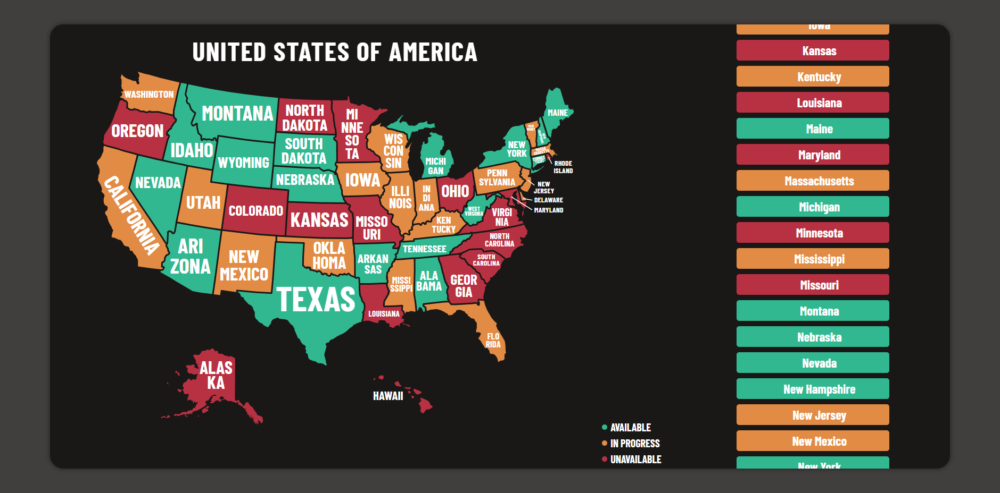

# USA Map Viewer 🌍

Une carte interactive simple des États-Unis, séparée par états, créée avec **Vue.js 3**, **HTML**, et **CSS**.

## 📜 Fonctionnalités

- 🗺️ Carte SVG des États-Unis avec chaque état identifié individuellement.
- 🎨 Design épuré et minimaliste.
- 🚀 Code optimisé et modulaire avec Vue.js 3.
- 🌐 Facilement extensible pour des interactions supplémentaires (comme des clics sur les états ou des infobulles).

## 🚀 Aperçu




# vue-project

This template should help get you started developing with Vue 3 in Vite.

## Recommended IDE Setup

[VSCode](https://code.visualstudio.com/) + [Volar](https://marketplace.visualstudio.com/items?itemName=Vue.volar) (and disable Vetur).

## Customize configuration

See [Vite Configuration Reference](https://vite.dev/config/).

## Project Setup

```sh
npm install
```

### Compile and Hot-Reload for Development

```sh
npm run dev
```

### Compile and Minify for Production

```sh
npm run build
```
